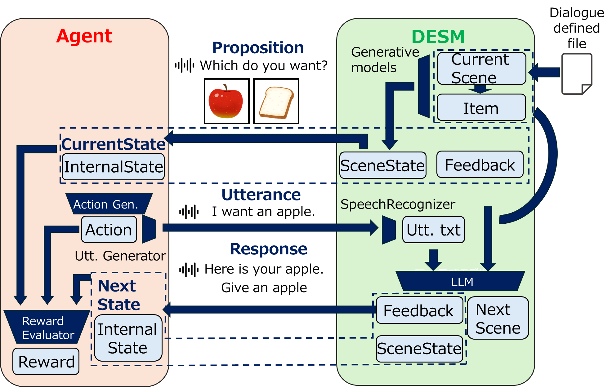

# Spolacq-GDS: Spoken Language Acquisition Generative Dialogue Simulator

## Overview
This is the official implementation of [Spolacq-GDS]().

## About auther

[Shinozaki Lab Science Tokyo](http://www.ts.ip.titech.ac.jp/)

## Preparation

Need Python>=3.10. 3.10.15 is recommended.
We use pyenv and poetry for environment creation.

Linux/macOS
```
poetry install
source <env_name>/bin/activate
```

Windows
```
poetry install
./<env_name>/Scripts/activate
```

## Usage
Please run the following command in your virtual environment.

```
python main.py --experiment_config_name yy.yaml
```

On `yy`, please specify the name of the config file(yaml).
Then, you can start learning!
You can specify `food_task.yaml` or `food_corner_task.yaml` as samples. The explanation of food_task or food_corner_task is given on [here]().

If you want to change what agent or task to use on learning, please change `agent_name` or `task_name` in the config file(yaml).
For the details how to write it, please refer to `How to write config file(yaml)` below.

## Introduction

This, Spolacq-GDS, is the multi-modal dialogue simulator that controls scene transition by automaton and generates natural dialogue action with generative models on each scene.
It generates data with image generator and audio generator, and interpret audio, generate response, transit state and give items with LLM, ASR and audio generator.
The figure of this simulator is as follows:


(DESM: DialogueEnvironmentStateManger)

You can use this simulator by defining dialogue task (dialogue defined file) and agent.
It auto-generates automaton and data for scenario from defined file, uses them and roles as an opponent of the dialogue, then give the environment for dialogue reinforcement learning.

This simulator generally targets the agents and the tasks that use images and audio (optional) as inputs, and audio as an output, but you might want to use other modalities. You can do it by defining wrappers. Here wrapper can be defined by inheriting Wrapper class given by [Gymnasium](https://gymnasium.farama.org/)

On this simulator, there are a pre-defined sample task, food_task, and the agent ([Continuous Action Space-Based Spoken Language Acquisition Agent Using Residual Sentence Embedding and Transformer Decoder](https://ieeexplore.ieee.org/document/10096250)) that can handle with that task. This agent receives image and outputs audio, but your agent might have to receive audio as an input. Even though, you can contain it in the observation or preprocess it without changing implementation of the environment.

You can see sample codes of task by visiting under `tasks` directory.
You can see sample codes of dialogue agent by visiting under `agents` directory.

## Define tasks
Here I will explain how to define the task.
At first, please decide the name of the task, and make the directory whose name is that.
After that, please make following files in it.
- `xx.json`
- `task_functions.py`
- `utterance_patterns.json`
- `task_config.json`

On `xx`, you can specify arbitrary name.

Also, you can add following files.
- `task_wrappers.py`

### `xx.json`
On this file please define the task.
For the details how to write it, please refer to `How to write task json file` below.

### `task_functions.py`
On this file, please define the function needed to have dialogue learning.
To be detailed, following functions are defined.

| Function | Return value | Role |
| - | - | - |
| reward_function | float | Returns reward according to the previous environment and the next one. |
| termination_function | bool | Returns whether it terminates according to the previous environment and the next one. |
| truncation_function | bool | Returns whether it truncates according to the next environment. |
| internal_state_update_function | numpy.ndarray | Returns next internal state according to the internal state on this step and the feedback of dialogue. |
| observation_function | dict[str, numpy.ndarray] | Returns observation space according to the next environment. |
| initial_internal_state_function | numpy.ndarray | Returns the internal state when the environment resets. |

The error will occur if any function on the above isn't defined.

About `EnvironmentState` class, that is one of the arguments of these functions, please refer to the explanation on the later section.

### `utterance_patterns.json`
On this file, please define what speech will be used on pretraining.
You can make suitable sentences for each scene.

The format of this file can be as follows:

```json
{
  "scene": {
    "japanese_food_corner":"food_corner",
    "western_food_corner":"food_corner"
  },
  "food_corner": [
    "{name}",
    "i want to go to the {name}",
    "let's go to the {name}",
    "i'd like to visit the {name}",
    "take me to the {name}"
  ],
  "else": [
    "{name}",
    "i want {name}",
    "i would like to have {name}",
    "i'll take {name}",
    "give me {name}"
  ]
}
```

As the above, if you give identifier (here `food_corner`) on the `scene`, the audio will be generated based on the utterance patterns on `food_corner` on the scenes that takes `food_corner` as an identifier. If the identifier isn't given, the audio will be generated based on the utterance patterns on `else` on the scenes.

Then, the placeholder `{name}` will be replaced by the name of the item.

### `task_config.json`
Finally, please add `task_config.json` in the folder.
This file has the following format:

```json
{
  "env_name": "FoodTask-v0",
  "make_env": "tasks.food_task.task_wrappers:wrap_task_env",
  "max_step": 2,
  "task_config_name": "food_task_prompt.json"
}
```

These contents are following things:

| content | explanation |
| - | - |
| env_name | The task name on gymnasium. |
| make_env (optional) | The function name if you wrap the environment with following `task_wrappers.py` etc. |
| max_step | The max step of the dialogue. |
| task_config_name | The file name of the former `xx.json`. |

### `task_wrappers.py`
You can add `task_wrappers.py` to wrap with the environment by `Wrapper` of `gymnasium`.
If so, please add following codes after the definition of the wrapper, on `task_wrappers.py`.

```py
def wrap_task_env(base_env):
    wrapped_env = YourOriginalWrapper(base_env)
    return wrapped_env
```

## Define agent
Here I will explain how to define the agent that will learn dialogue.
To define dialogue learning agent, please make the directory whose name is the name of the agent under `agents`.
Next please make the following file in it.
- `agent.py`
- `trainer.py`
- `agent_config.json`

You have to define agent on `agent.py` and trainer on `trainer.py`.
Then you define used classes on `agent_config.json`.
This is the example.

```json
{
    "agent_class": "AgentWithUnits",
    "trainer_class": "Trainer"
}
```

Here you should define the name of the classes of agent and trainer.

From here, you diverge implementing ways whether you use units on language or image (such as audio representations or image representations) and so on.

### Agents without using units
To learn the simplest (and the most free) dialogue agent, it's easiest to use the agent that inherits `BaseAgent`.
This `BaseAgent` has some needed APIs to have dialogue learning.

| name | return value | explanation |
| - | - | - |
| action2speech | numpy.ndarray | It converts action of reinforcement learning to audio data. <font color="red">This function won't be used unless you define Wrapper.</font> |

Then, it's simple to define trainer, with inheriting `BaseTrainer`.
`BaseTrainer` has following APIs.

| name | return value | explanation |
| - | - | - |
| pretrain | None | If you have some modules that needs to be pretrained, please define this function. |
| train_rl | None | Function that has procedure of reinforcement learning of agent. |

Please refer to `sample01` under `agents` as an example of implementation. This is the agent proposed on [Continuous Action Space-Based Spoken Language Acquisition Agent Using Residual Sentence Embedding and Transformer Decoder](https://ieeexplore.ieee.org/document/10096250).

### Agents with using units

The files to be defined are same, but if you use units, you can define agent with inheriting `BaseAgentWithUnits`. Then you can define easier because you can use the following properties.

| name | type/return value | explanation |
| - | - | - |
| i2u | BaseImage2Unit | The instance of Image2Unit. |
| s2u | BaseSpeech2Unit | The instance of Speech2Unit. |
| u2s | BaseUnit2Speech | The instance of Unit2Speech. |

Also, you have to define the trainer that inherits `BaseTrainerWithUnits`, that has following functions.

| name | type/return value | explanation |
| - | - | - |
| train_i2u | None | Please define if you train I2U model. |
| train_u2s | None | Please define if you train U2S model. |

## How to write task json file

Task json file should be named as `xx.json`, and place it in task folder (e.g. in tasks/food_task for food_task).
Here `xx` is the value that is specified on `task_config_name` in `task_config.json`.

Task file can be structured as follows:

```json
{
  "initial_scene_id": 0,
  "items": [
    {
      "id": 1,
      "name": "<item name 1>",
      "attributes": {}
    },
    ...
  ],
  "scenes": [
    {
      "id": 0,
      "name": "<scene name one>",
      "role_description": "<description of role>",
      "speaker_description": "<description of speaker>",
      "items": [<IDs of items that can be taken on this scene>],
      "possible_next_scenes": [<IDs of scenes that it can transit from this scene to>],
      "system_guidelines": "<Description that how simulator gives items or transits the scenes>"
    },
    ...
  ]
}
```

As the above, please specify the following values.
- `initial_scene_id`
- `items`
- `scenes`

On `initial_scene_id`, please specify the id of the scene of the first step. We will explain scene later.

On `items`, please register the items that will appear on this dialogue, with list format.
You will specify the objects (often called "item") that has the following values in `items`.

| name | value |
| - | - |
| id | Integer that identifies the item. |
| name | Name of the item. |
| attributes | Attributes you want to have the item to take. |
| prompts (optional) | The image for this item will be generated based on this prompt. On default, the prompt is "A {name} on a white background, uncooked, realistic.", on `{name}` is the name of this item. |

On `scenes`, please register the scene that will appear on this dialogue, with list format.
You will specify the objects (often called "scene") that has the following values in `scenes`.

| name | value |
| - | - |
| id | Integer that identifies the scene. |
| name | Name of the scene. |
| role_description | What role this dialogue simulator plays. |
| speaker_description | What characteristics of person replies by this dialogue simulator. To see what you can choice, please refer to https://huggingface.co/hexgrad/Kokoro-82M/blob/main/VOICES.md#american-english |
| items | Ids of items that might be treated on this scene. |
| possible_next_scenes | Ids that will be the next scene of this. From this value and the all of scenes, you can construct automaton. |
| system_guidelines | The prompt that explains what situation this dialogue simulator is on. This will be input to LLM and the dialogue simulator decides what to reply. |

You can refer to `food_task.json` or `food_corner_task.json` in `tasks/food_task` or `tasks/food_corner_task` as examples.

## How to write config file(yaml)

The name of config file can be arbitrary, but place it in `experiments` folder.

Config file can be structured as follows:

```yaml
base:
  task_name: "food_task"
  agent_name: "sample01"
  device: "cuda"
  dir_id: "1"
  sampling_rate: 22050


pretrain:
  audio:
    noise_num: 5
    overwrite_audio_dataset: False
    SNR: 30
    model_name: "kokoro"
    voice: "af_heart"
  image:
    train_images_per_folder: 30
    test_images_per_folder: 10
    overwrite_image_dataset: False
    batch_size: 16
    model_name: "Mann-E_Turbo"
    
    model:
      num_inference_steps: 10
      guidance_scale: 8.0
      height: 512
      width: 512

rl:
  env:
    device: "cuda"
    num_images_per_item: 10
    enable_audio_response: False
    record_train_env: False
    record_eval_env: False
    llm_prompt_name: "food_task.txt"

  agent:
    ...
```

The above keys are at least needed if you don't change files under `env` and `main.py`, so they might not be necessary if you modify the codes.
The explanation of each key is as follows:

| variable name | explanation |
| - | - |
| task_name | The folder name of task. |
| agent_name | The folder name of agent for training. |
| (base) device | The device for training. We recommend "cuda". |
| dir_id | The ID for the directory that the log is saved in. We recommend to set number like 1 or 2. |
| sampling_rate | Sampling rate that the agent uses. |
| noise_num | It represents how many patterns of sounds with noise will be generated for pretraining. |
| overwrite_audio_dataset | Whether the dataset is overwritten if it already exists. |
| SNR | Signal-to-Noise Ratio. |
| (pretrain->audio) model_name | Which model to generate audio. Now only "kokoro" is supported. |
| voice | Which voice will be used. If you specify "kokoro" as `model_name`, you can refer to https://huggingface.co/hexgrad/Kokoro-82M/blob/main/VOICES.md#american-english to decide which to use. |
| train_images_per_folder | How many images for training will be generated for each item. |
| test_images_per_folder | How many images for test will be generated for each item. |
| overwrite_image_datset | Whether the dataset is overwritten if it already exists. |
| batch_size | Image generation model will generate how many images for pretraining at once. |
| (pretrain->image) model_name | Which model to generate images. Now only "Mann-E_Turbo" is supported. |
| num_inference_steps | How many steps will be used for inference on diffusion model for image generation. |
| guidance_scale | How loyal the image generation model to generation prompt. |
| height | The height of the images. |
| width | The width of the images. |
| (rl->env) device | The device for training. We recommend "cuda". |
| num_images_per_item | On reinforcement learning how many images will be used on each item. |
| enable_audio_response | Whether we use audio input on reinforcement learning. <font color="red">If you want to use audio input with food_task or food_corner_task, please turn this to True and please remove the comment on `observation["audio"] = ...` in `task_functions.py` in task folder.</font> |
| record_train_env | Whether it records dialogue history on training of reinforcement learning. |
| record_eval_env | Whether it records dialogue history on evaluation of reinforcement learning. |
| llm_prompt_name | The file of prompt given for environment LLM. For more details for this file, please refer to `How to write prompt file` below. |

Addition to these, you can contain parameters needed for the training of your agent.
In the codes, each section and variables are corresponded as follows:

| The section if the whole config file is as config | variable in codes |
| - | - |
| config["base"] | base_config |
| config["pretrain"] | pretrain_config |
| config["pretrain"]["audio"] | pretrain_audio_config |
| config["pretrain"]["image"] | pretrain_image_config |
| config["rl"] | rl_config |
| config["rl"]["env"] | rl_env_config |
| config["rl"]["agent"] | rl_agent_config |

If you want to refer to the parameters, please add mappings on the proper section and read them.

## How to write prompt file

On this simulator, LLM judges all of transitions of the scenes and how to give the items on each task.
Therefore, we specify how LLM judges by prompt on each task. On constructing task, please write that file and save it under `env/prompts`.

The format of the prompt file can be as follows:

```txt
You are {role_description}. Generate a response based on the following guidelines to interact with the customer effectively.

Scene Information:
{scene_information}

Available Items:
{available_items_text}
Note: Only offer the listed items if the customer specifically and clearly chooses one, using correct grammar. Do not offer any other items, even if the customer requests something else or mentions the item indirectly.

Scene Transitions:
{transitions}

Guidelines:
{guidelines}

Response Format:
Your response should follow this JSON format:
{{
"response_text": "text of response", 
"next_scene_id": scene ID (or null if staying in the current scene),
"next_scene_reason": "reason for transition (or null if staying in the current scene)", 
"item_name": "name of the food item offered (or null if no item is offered)"
}}
```

Here we can use placefolder with using brackets.
Each has following meaning.

| name | explanation |
| - | - |
| role_description | `role_description` in task json file will be assigned. |
| scene_information | The text that unites all of scenes. |
| available_items_text | All items that can be offered now. |
| transitions | The text that explains how it can transit scenes. |
| guidelines | `system_guidelines` in task json file will be assigned. |

## API Reference

### `EnvironmentState` class

`EnvironmentState` class contains the environment state.
This class contains the following get-only properties.

| name | type | explanation |
| - | - | - |
| dialogue_scene | DialogueScene | Contains dialogue scene. |
| dialogue_feedback | Optional[DialogueFeedback] | Contains dialogue feedback. If the dialogue isn't held, this contains `None`. |
| internal_state | numpy.ndarray | Internal state at this time. |

### `DialogueScene` class

`DialogueScene` class contains the dialogue scene at some point.
This class contains the following get-only properties.

| name | type | explanation |
| - | - | - |
| scene_id | int | The scene id on this point. The id is same as on the task defined file. |
| prompt_waveform | numpy.ndarray | The utterance from the environment. |
| images | list[numpy.ndarray] | The images proposed by the environment. |

### `DialogueFeedback` class

`DialogueFeedback` class contains the feedback on the dialogue.
This class contains the following get-only properties.

| name | type | explanation |
| - | - | - |
| selected_item | Optional[FeedbackItem] | The item proposed on this dialogue. If nothing was given, this contains `None`. |
| response_waveform | numpy.ndarray | The utterance from the environment based on the agent's utterance. |

### `FeedbackItem` class

`FeedbackItem` class represents the item given as the result of the dialogue.
This class contains the following get-only properties.

| name | type | explanation |
| - | - | - |
| id | int | Represents item ID. Item ID is the same as on the task defined file. |
| image | Optional[numpy.ndarray] | The image itself. |
| attributes | dict[str, Any] | `attributes` defined on this item on the task defined file. |

## License
Copyright (C) 2025- Shinozaki Lab Science Tokyo

Licensed under the Apache License, Version 2.0 (the "License"); you may not use this file except in compliance with the License. You may obtain a copy of the License at

```
http://www.apache.org/licenses/LICENSE-2.0
```

Unless required by applicable law or agreed to in writing, software distributed under the License is distributed on an "AS IS" BASIS, WITHOUT WARRANTIES OR CONDITIONS OF ANY KIND, either express or implied. See the License for the specific language governing permissions and limitations under the License.

## Credits

LLM: [Phi-4-mini-instruct](https://huggingface.co/microsoft/Phi-4-mini-instruct)<br>
ASR: [Whisper-large-v3-turbo](https://huggingface.co/openai/whisper-large-v3-turbo)<br>
TTS: [Kokoro-82M](https://huggingface.co/hexgrad/Kokoro-82M)<br>
Image generator: [Stable diffusion](https://huggingface.co/stabilityai/stable-diffusion-xl-base-1.0) + [Mann-E_Turbo](https://huggingface.co/mann-e/Mann-E_Turbo)
