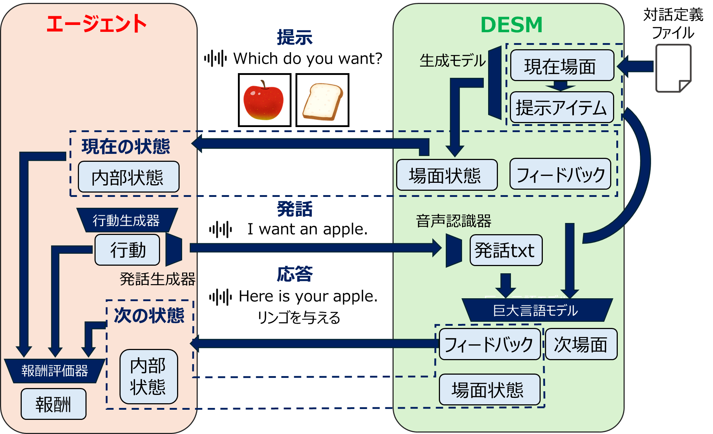

# Spolacq-GDS: Spoken Language Acquisition Generative Dialogue Simulator

## 概要
こちらは，[Spolacq-GDS]()の公式実装になります。

## 著者について

[東京科学大学 篠﨑研究室](http://www.ts.ip.titech.ac.jp/)

## 事前準備

Python>=3.10 が必要です。推奨は 3.10.15 です。
また，環境構築に pyenv と poetry を用いています。

Linux/macOS
```
poetry install
source <env_name>/bin/activate
```

Windows
```
poetry install
./<env_name>/Scripts/activate
```

## 使用方法

仮想環境に入った状態で，次のコマンドを実行してください。

```
python main.py --experiment_config_name yy.yaml
```

この `yy` には，設定ファイル(yaml)の名称を指定してください。
これで無事，学習を始めることができます！
サンプルとして，`food_task.yaml` または `food_corner_task.yaml` を指定することができます。food_task および food_corner_task の説明については，[こちら]()をご覧ください。

もし，学習に使用するエージェントやタスクを変更したい場合は，この設定ファイル(yaml)の `agent_name` または `task_name` を変更してください。
設定ファイルの詳しい書き方は，下記 `設定ファイル(yaml)の書き方` を参照してください。

## イントロダクション

当シミュレータ Spolacq-GDS は，オートマトンにより場面遷移を制御し，各場面に応じて生成モデル群が自然な対話行動を生成するマルチモーダル対話シミュレータです。
画像生成器と音声合成器によってデータを生成し，LLM，自動音声認識器，音声合成器によって音声解釈，返答生成，状態遷移とアイテム提供を行います。
シミュレータの概要図は以下のようになります。


（DESM: DialogueEnvironmentStateManger）

当シミュレータは，対話タスク（対話定義ファイル）とエージェントを定義することで利用できます。
定義ファイルからオートマトンとシナリオ用データを自動生成し，それらを用いてシミュレータが対話相手として応答することで，エージェントに対話型強化学習環境を提供します。

なお，当シミュレータは基本的に画像と音声（任意）を入力として，音声を出力とするような対話エージェントおよびタスクを対象としていますが，場合によっては他のモダリティを扱いたい場合もあると思います。これは，エージェントまたはタスク側において，それぞれラッパを定義することで対応できます。ラッパは一般的な環境ラッパである [Gymnasium](https://gymnasium.farama.org/) の Wrapper クラスを継承して定義します。

当シミュレータでは例として，事前に定義されているサンプルタスクである food_task と，そのタスクを学習できるエージェント（[Continuous Action Space-Based Spoken Language Acquisition Agent Using Residual Sentence Embedding and Transformer Decoder](https://ieeexplore.ieee.org/document/10096250)）を同梱しております。このエージェントは画像を受け取り，音声を出力するタイプのエージェントですが，ひょっとするとあなたのエージェントは入力に音声も含める必要があるかもしれません。その場合でも，環境の実装を直接触ることなく観測に含めたり，音声の前処理を追加したりできます。

なお，タスクのサンプルコードについては，`tasks` ディレクトリ以下をご覧ください。
対話エージェントのサンプルコードについては，`agents` ディレクトリ以下をご覧ください。

## タスクを定義する
ここでは，タスクの定義の仕方を説明します。
まず，タスクの名称を決め，その名称で `tasks` 以下にディレクトリを作成してください。
その後，作成したディレクトリの中に，次のファイルを作成してください。
- `xx.json`
- `task_functions.py`
- `utterance_patterns.json`
- `task_config.json`

`xx` には，任意の名称を指定できます。

また，次のようなファイルも追加することができます。
- `task_wrappers.py`

### `xx.json`
このファイルには，タスクの定義を記述します。
詳しい書き方は，下記 `タスクjsonファイルの書き方` を参照してください。

### `task_functions.py`
このファイルには，対話学習を行うにあたって必要な関数を定義します。
具体的には，次のような関数を定義します。

| 関数名 | 返り値 | 役割 |
| - | - | - |
| reward_function | numpy.ndarray | 前の環境と次の環境から，報酬を返します。 |
| termination_function | bool | 前の環境と次の環境から，そのステップでterminationするかを返します。 |
| truncation_function | bool | 次の環境から，そのステップでtruncationするかを返します。 |
| internal_state_update_function | numpy.ndarray | 現時点での内部状態と，対話のフィードバックから，次の内部状態を返します。 |
| observation_function | numpy.ndarray | 次の環境から，観察空間を返します。 |
| initial_internal_state_function | numpy.ndarray | 環境がリセットされるときの内部状態を返します。 |

これらの関数のうちいずれでも定義されていない場合は，エラーが発生します。

なお，これらの関数の引数の一つのクラスである `EnvironmentState` クラスについては，別途下記にある説明もご覧ください。

### `utterance_patterns.json`
このファイルには，事前学習に使われる音声を定義してください。
それぞれのシーンに対して適切な発話を作成することができます。

このファイルのフォーマットは，例えば次のようにできます。

```json
{
  "scene": {
    "japanese_food_corner":"food_corner",
    "western_food_corner":"food_corner"
  },
  "food_corner": [
    "{name}",
    "i want to go to the {name}",
    "let's go to the {name}",
    "i'd like to visit the {name}",
    "take me to the {name}"
  ],
  "else": [
    "{name}",
    "i want {name}",
    "i would like to have {name}",
    "i'll take {name}",
    "give me {name}"
  ]
}
```

上記のように，`scene` において個別に識別子（ここでは `food_corner`）を与えると，そのシーンにおいては `food_corner` に与えられている発話パターンを用いて音声が生成され，識別子が与えられていないものは `else` に与えられている発話パターンを用いて音声が生成されます。

なお，`{name}` プレースホルダはそのアイテム名に変更されます。

### `task_config.json`
最後に，ディレクトリに `task_config.json` を追加してください。
これは次のようなフォーマットを持ちます。

```json
{
  "env_name": "FoodTask-v0",
  "make_env": "tasks.food_task.task_wrappers:wrap_task_env",
  "max_step": 2,
  "task_config_name": "food_task_prompt.json"
}
```

各項目の内容は次の通りです。

| 項目 | 説明 |
| - | - |
| env_name | gymnasium 上のタスク名。 |
| make_env (任意) | 次の `task_wrappers.py` などで環境をラップする際，その関数名。 |
| max_step | 対話の最大ステップ数。 |
| task_config_name | 上記の `xx.json` の名称。 |

### `task_wrappers.py`
環境を `gymnasium` の `Wrapper` でラップしたい場合，`task_wrappers.py` を追加することで対応できます。
その場合は，`task_wrappers.py` にラッパーのコードを記述したのち，次のコードを追加してください。

```py
def wrap_task_env(base_env):
    wrapped_env = YourOriginalWrapper(base_env)
    return wrapped_env
```

## エージェントを定義する
ここでは対話学習を行うエージェントを定義する方法を説明します。
対話学習を行うエージェントを定義するには，まず `agents` 以下にそのエージェント名のディレクトリを作成してください。
次にそのディレクトリの中に
- `agent.py`
- `trainer.py`
- `agent_config.json`

を作成してください。

`agent.py` にはエージェントを，`trainer.py` にはトレーナーを定義します。
その後，`agent_config.json` で，使用するクラスを定義します。
以下は実装例です。

```json
{
    "agent_class": "AgentWithUnits",
    "trainer_class": "Trainer"
}
```
ここでは，エージェントおよびトレーナーのクラス名を明記してください。

`agent.py` および `trainer.py`は，言語や画像などにおいてユニット（音声表現，画像表現）を使用するか否かで実装法が分岐します。

### ユニットを使用しないエージェント
単純な，（最も自由度の高い）対話エージェントを学習する場合，`BaseAgent` を継承してエージェントを定義するのが最も簡単です。
この `BaseAgent` は，Spolacq-GDSで対話学習を行うにあたって，必要なAPIをそろえています。

| 関数名 | 返り値 | 説明 |
| - | - | - |
| pretrain | None | エージェントにおけるモジュールで，事前学習が必要な場合はここに定義。 |
| action2speech | np.ndarray | 引数で与えられた強化学習の行動(action)を，音声データに変換する関数。<font color="red">これは Wrapper を独自に定義して適用しないと使用されません。</font> |

その後，`BaseTrainer` を継承してトレーナーを定義するのが簡便です。
`BaseTrainer` は次のようなAPIを持ちます。

| 関数名 | 返り値 | 説明 |
| - | - | - |
| pretrain | None | エージェントにおけるモジュールで，事前学習が必要な場合はここに定義。 |
| train_rl | None | エージェントを強化学習する際の手順を定義する関数。 |

実装例は，`agents` 以下の `sample01` をご覧ください。
こちらは，[Continuous Action Space-Based Spoken Language Acquisition Agent Using Residual Sentence Embedding and Transformer Decoder](https://ieeexplore.ieee.org/document/10096250)のエージェントを実装したものです。

### ユニットを使用するエージェント
定義するファイルはユニットを使用しないバージョンと同じですが，ユニットを使用する場合は 
`BaseAgentWithUnits` クラスを継承して，エージェントを実装できます。そうすると，上述の `BaseAgent` のAPIに加えて，次のようなプロパティも提供され，より便利になります。

| 名前 | 型/返り値 | 説明 |
| - | - | - |
| i2u | BaseImage2Unit | Image2Unit のインスタンス。 |
| s2u | BaseSpeech2Unit | Speech2Unit のインスタンス。 |
| u2s | BaseUnit2Speech | Unit2Speech のインスタンス。 |
| train_i2u | None | I2Uモデルを訓練する場合定義してください。 |
| train_u2s | None | U2Sモデルを訓練する場合定義してください。 |
| train_s2u | None | S2Uモデルを訓練する場合定義してください。 |

## タスクjsonファイルの書き方

タスクjsonファイルは，名称を `<task_name>.json` として，タスクフォルダの中に配置してください。\<task_name\> にはタスクの名称を与えてください。

タスクファイルは，おおよそ次のような構造を持ちます。

```json
{
  "initial_scene_id": 0,
  "items": [
    {
      "id": 1,
      "name": "<アイテム名1>",
      "attributes": {}
    },
    ...
  ],
  "scenes": [
    {
      "id": 0,
      "name": "<シーン名1>",
      "role_description": "<話者の役割>",
      "speaker_description": "<話者・音声の特徴>",
      "items": [<このシーンで取得する可能性のあるアイテムのid一覧>],
      "possible_next_scenes": [<このシーンからの遷移先となる可能性のあるシーンのid一覧>],
      "system_guidelines": "<どのようにアイテムを渡すか，どのようにシーンを遷移するかの説明文>"
    },
    ...
  ]
}
```

このように，jsonのトップレベルには下記の3項目を指定します。

- `initial_scene_id`
- `items`
- `scenes`

`initial_scene_id` には，最初のステップにおけるシーンのidを指定します。シーンについては後述します。

`items` には，この対話で出現するアイテムを，list形式で登録します。
この `items` に登録されるオブジェクト（アイテム）は，次のような値を指定します。

| 名称 | 値 |
| - | - |
| id | アイテムを識別する固有の整数値。 |
| name | アイテムの名前。 |
| attributes | アイテムに持たせたい性質をオブジェクトで指定。 |
| prompts (任意) | このアイテムに対応する画像を生成する際のプロンプト。デフォルトではそのプロンプトは "A {name} on a white background, uncooked, realistic."。ただし `{name}` はこのアイテムの名前。 |

`scenes` には，この対話で出現するシーンを，list形式で登録します。
この `scenes` に登録されるオブジェクト（シーン）には，次のような値を指定します。

| 名称 | 値 |
| - | - |
| id | シーンを識別する固有の整数値。 |
| name | シーンの名前。 |
| role_description | 対話シミュレータがどのような役割を担うかの説明。 |
| speaker_description | 対話シミュレータの返答がどのような話者によるものかの説明。何が選択できるかは https://huggingface.co/hexgrad/Kokoro-82M/blob/main/VOICES.md#american-english を参照してください。 |
| items | このシーンで扱われる可能性のあるアイテムのid。 |
| possible_next_scenes | このシーンの次のシーンとなりうるシーンのIdを表す。この値と全てのシーンから，オートマトンを構成できる。 |
| system_guidelines | 対話シミュレータがそのシーンにおいてどのような状況に置かれているかの説明。これがLLMに入力され，対話シミュレータは返答を決定。 |

例については，`tasks` 内の `food_task` 内または `food_corner_task` 内にある `food_task.json` または `food_corner_task.json` を参照してください。

## 設定ファイル(yaml)の書き方

設定ファイルは，任意の名称で，`experiments` フォルダ以下に配置してください。

設定ファイルは，おおよそ次のような構造を持ちます。

```yaml
base:
  task_name: "food_task"
  agent_name: "sample01"
  device: "cuda"
  dir_id: "1"
  sampling_rate: 22050


pretrain:
  audio:
    noise_num: 5
    overwrite_audio_dataset: False
    SNR: 30
    model_name: "kokoro"
    voice: "af_heart"
  image:
    train_images_per_folder: 30
    test_images_per_folder: 10
    overwrite_image_dataset: False
    batch_size: 16
    model_name: "Mann-E_Turbo"
    
    model:
      num_inference_steps: 10
      guidance_scale: 8.0
      height: 512
      width: 512

rl:
  env:
    device: "cuda"
    num_images_per_item: 10
    enable_audio_response: False
    record_train_env: False
    record_eval_env: False
    llm_prompt_name: "food_task.txt"

  agent:
    ...
```

上記の設定ファイルは，`env` 以下のファイルと `main.py` を変更しない場合，少なくとも必要な設定項目になります。
コードを変更して使用される場合はその限りではありません。
各項目の説明は以下の通りです。

| 変数名 | 説明 |
| - | - |
| task_name | タスクのフォルダ名を指定してください。|
| agent_name | 訓練に使用するエージェントのフォルダ名を指定してください。|
| (base) device | 訓練に使用するデバイスを指定してください。基本は "cuda" を推奨します。|
| dir_id | ログを保存するディレクトリのidを与えてください。1や2などの数字を与えることを推奨します。|
| sampling_rate | エージェントが使用するサンプリングレート。|
| noise_num | 事前学習用に生成する音声について，ノイズを含む音声を何パターン生成するかを指定します。|
| overwrite_audio_dataset | すでに生成された音声データセットがあった場合，それを上書きするかを指定します。|
| SNR | 信号対雑音比。元の音声とノイズのパワー比をデシベル表記したものです。|
| (pretrain->audio) model_name | 何のモデルを音声合成に用いるか指定してください。現状では "kokoro" のみ対応しています。|
| voice | どういった声色を用いるか指定してください。`model_name` が "kokoro" の場合，何を指定できるかは，https://huggingface.co/hexgrad/Kokoro-82M/blob/main/VOICES.md#american-english を参照してください。 |
| train_images_per_folder | 各アイテムについて，何枚の訓練用画像を生成するかを指定します。|
| test_images_per_folder | 各アイテムについて，何枚のテスト用画像を生成するかを指定します。|
| overwrite_image_dataset | すでに生成された画像データセットがあった場合，それを上書きするかを指定します。|
| batch_size | 事前学習用画像生成モデルが一度に生成する画像の枚数を指定します。|
| (pretrain->image) model_name | 何のモデルを画像生成に用いるか指定してください。現状では "Mann-E_Turbo" のみ対応しています。|
| num_inference_steps | 画像生成の拡散モデルが推論に何ステップ使用するかを指定します。|
| guidance_scale | 画像生成モデルがどれだけ生成プロンプトに忠実にするかを指定します。|
| height | 画像の高さを指定します。|
| width | 画像の幅を指定します。|
| (rl->env) device | 訓練に使用するデバイスを指定してください。基本は "cuda" を推奨します。|
| num_images_per_item | 各アイテム1つにつき，強化学習中に何枚の画像を使用するかを指定します。|
| enable_audio_response | 強化学習中に音声入力を使用するかを指定します。<font color="red">音声を使用する場合，food_task または food_corner_task 使用時は，これを True にするのと同時に，タスクフォルダ内の `task_functions.py` にある `observation["audio"] = ...` の行のコメントを外す必要があります。</font> |
| record_train_env | True のとき，訓練において，強化学習の対話履歴を記録します。|
| record_eval_env | True のとき，評価において，強化学習の対話履歴を記録します。|
| llm_prompt_name | 環境LLMに渡すプロンプトを記述したファイルの名前を指定します。このプロンプトファイルの詳細は，以下の `プロンプトファイルの書き方` をご覧ください。|

また，上記に加え，あなたのエージェントの学習に必要なパラメータはこのファイルに含めることができます。
コード中において，各セクションと変数名は次のように対応しています。

| 設定ファイル全体を config とするときのセクション | コード中の対応する変数 |
| - | - |
| config["base"] | base_config |
| config["pretrain"] | pretrain_config |
| config["pretrain"]["audio"] | pretrain_audio_config |
| config["pretrain"]["image"] | pretrain_image_config |
| config["rl"] | rl_config |
| config["rl"]["env"] | rl_env_config |
| config["rl"]["agent"] | rl_agent_config |

事前学習や強化学習のフェーズにおいて，もしパラメータを参照したい場合，適切なセクションにマッピングを追加し，読みだしてください。

例については，`experiments` フォルダ内の `food_task.yaml` または `food_corner_task.yaml` を参照してください。

## プロンプトファイルの書き方

当シミュレータでは，各タスクについてどのように状態遷移し，アイテムを与えるのかということを，すべてLLMが判定します。
このため，各タスクについて，LLMがどう判定するべきかの指針を，プロンプトという形で指定します。タスク設計時にはそのファイルを記述し，`env/prompts` 以下に保存してください。

プロンプトファイルのフォーマットは，例えば次の通りです。
```txt
You are {role_description}. Generate a response based on the following guidelines to interact with the customer effectively.

Scene Information:
{scene_information}

Available Items:
{available_items_text}
Note: Only offer the listed items if the customer specifically and clearly chooses one, using correct grammar. Do not offer any other items, even if the customer requests something else or mentions the item indirectly.

Scene Transitions:
{transitions}

Guidelines:
{guidelines}

Response Format:
Your response should follow this JSON format:
{{
"response_text": "text of response", 
"next_scene_id": scene ID (or null if staying in the current scene),
"next_scene_reason": "reason for transition (or null if staying in the current scene)", 
"item_name": "name of the food item offered (or null if no item is offered)"
}}
```

ここで，いわゆるプレースホルダを，波かっこを用いて示すことができます。
それぞれは以下のような意味を持ちます。

| 名称 | 説明 |
| - | - |
| role_description | タスクjsonファイルで指定した `role_description` が代入されます。|
| scene_information | シーン一覧をまとめたテキストが入ります。|
| available_items_text | 現在提供可能なアイテム名が列挙されます。|
| transitions | 遷移可能なシーン一覧をまとめたテキストが入ります。|
| guidelines | タスクjsonファイルで指定した `system_guidelines` が代入されます。|

## APIリファレンス

### `EnvironmentState` クラス

`EnvironmentState` クラスは，環境の状態を格納したクラスです。
このクラスは，以下の取得のみ可能なプロパティを含んでいます。

| 名前 | 型 | 説明 |
| - | - | - |
| dialogue_scene | DialogueScene | 対話場面を格納しています。|
| dialogue_feedback | Optional[DialogueFeedback] | 対話によるフィードバックを格納しています。まだ会話が行われていない状態のときは，`None` が与えられます。|
| internal_state | numpy.ndarray | この時点での内部状態を格納しています。|

### `DialogueScene` クラス

`DialogueScene` クラスは，ある時点での対話場面を格納したクラスです。
このクラスは，以下の取得のみ可能なプロパティを含んでいます。

| 名前 | 型 | 説明 |
| - | - | - |
| scene_id | int | この時点での場面IDを表します。場面IDはタスク定義ファイルにあるものと同一です。|
| prompt_waveform | numpy.ndarray | 環境側の発話です。|
| images | numpy.ndarray | 環境側が提示している画像です。|

### `DialogueFeedback` クラス

`DialogueFeedback` クラスは，ある時点での対話によるフィードバックを格納したクラスです。
このクラスは，以下の取得のみ可能なプロパティを含んでいます。

| 名前 | 型 | 説明 |
| - | - | - |
| selected_item | Optional[FeedbackItem] | この対話で提供されたアイテムを表します。何も提供されなかった場合は `None` が与えられます。|
| response_waveform | numpy.ndarray | エージェントの発話について，環境側が返した発話です。|

### `FeedbackItem` クラス

`FeedbackItem` クラスは，対話の結果与えられたアイテムを表します。
このクラスは，以下の取得のみ可能なプロパティを含んでいます。

| 名前 | 型 | 説明 |
| - | - | - |
| id | int | アイテムIDを表します。アイテムIDはタスク定義ファイルにあるものと同一です。|
| image | numpy.ndarray | 画像そのものを表します。|
| attributes | dict[str, Any] | タスク定義ファイルにおいて，このアイテムに対して定義されていた `attributes` を表します。|

## ライセンス
Copyright (C) 2025- Shinozaki Lab Science Tokyo

Licensed under the Apache License, Version 2.0 (the "License"); you may not use this file except in compliance with the License. You may obtain a copy of the License at

```
http://www.apache.org/licenses/LICENSE-2.0
```

Unless required by applicable law or agreed to in writing, software distributed under the License is distributed on an "AS IS" BASIS, WITHOUT WARRANTIES OR CONDITIONS OF ANY KIND, either express or implied. See the License for the specific language governing permissions and limitations under the License.

## クレジット

LLM: [Phi-4-mini-instruct](https://huggingface.co/microsoft/Phi-4-mini-instruct)<br>
ASR: [Whisper-large-v3-turbo](https://huggingface.co/openai/whisper-large-v3-turbo)<br>
TTS: [Kokoro-82M](https://huggingface.co/hexgrad/Kokoro-82M)<br>
Image generator: [Stable diffusion](https://huggingface.co/stabilityai/stable-diffusion-xl-base-1.0) + [Mann-E_Turbo](https://huggingface.co/mann-e/Mann-E_Turbo)
